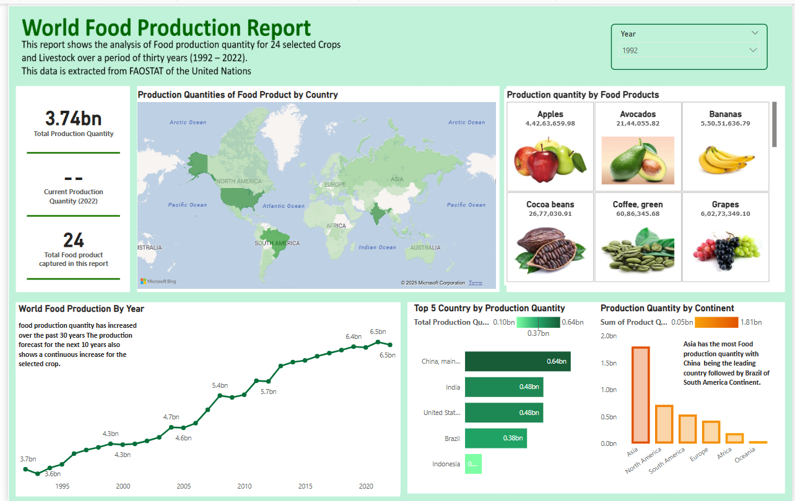

# 🌾 Power BI Dashboard: 30 Years of Global Food Production (1992–2022)

 

## 📌 Project Overview

This Power BI dashboard analyzes **global food production trends** over a 30-year period (1992–2022), using data from the **FAOSTAT** database. The project explores whether current food production levels are sufficient to sustain the growing global population — now over 8 billion.

The dashboard visualizes production quantities of **24 selected food crops and livestock products** by region and country, highlighting total production, trends over time, and regional contributions.

> 🎓 This project was created under the guidance of **Ruth Kingsley** via her YouTube tutorial series. All transformations and visualizations were done using **Power Query** and built-in Power BI features — no external modeling or calculated columns.

---

## 📊 Key Features

- ✅ Interactive dashboard with filters for **Region**, **Food Product**, and **Year**
- 📈 Visuals for **Total Production Quantity**, **Current Production**, and **Top Producing Regions**
- 🌍 Regional analysis using **Country–Continent mapping**
- 🖼️ Image cards using **Food Product URLs**

---

## 🧹 Data Cleaning & Transformation

Performed entirely in **Power Query**:

| Step | Description |
|------|-------------|
| ✅ Column Renames | `Items → Food Products`, `Value → Product Quantity` |
| 📆 Year Handling | Converted `Years` column from Number → Text → Date, and formatted to show only year (`1992`) |
| 🌐 Merged Tables | Loaded:  
   - `country–continent` table  
   - `Food Crops and Livestocks` table (renamed to `Food Product`) |
| 🔗 Relationships | One-to-many relationships automatically detected in Model View based on `Area` and `Food Products` |

---

## 📁 Dataset Details

- **Source**: [FAOSTAT](https://www.fao.org/faostat)
- **Years Covered**: 1992–2022
- **Columns in Main File**:
  - `Domain`, `Area`, `Element`, `Items`, `Years`, `Value`
- **Supporting Tables**:
  - `country–continent` mapping (`Area`, `Continent`)
  - `Food Product URLs` (`Food Product`, `Image URL`)

---

## 🧠 Insights

- Asia leads in total food production across the 30-year span.
- Top producers: **China**, **India**, and **USA**.
- Most produced categories include **rice**, **milk**, and **wheat**.

---

## 🙏 Acknowledgment

Huge thanks to **Ruth Kingsley** for her helpful and beginner-friendly Power BI tutorials on YouTube. This project was completed by following her step-by-step guidance.

---

## 📂 How to Use

1. Download the `.pbix` file from this repo.
2. Open in Power BI Desktop.
3. Refresh data (if needed) and explore the dashboard.

---

## 📬 Contact

Feel free to connect with me on [LinkedIn](https://www.linkedin.com/in/roshni-kumari2002/) or reach out via email if you'd like to collaborate or ask questions.

---

## 📌 Tags

`Power BI` `Data Visualization` `FAOSTAT` `Food Production` `Power Query` `Beginner Project` `Ruth Kingsley Tutorial` `Global Trends`

